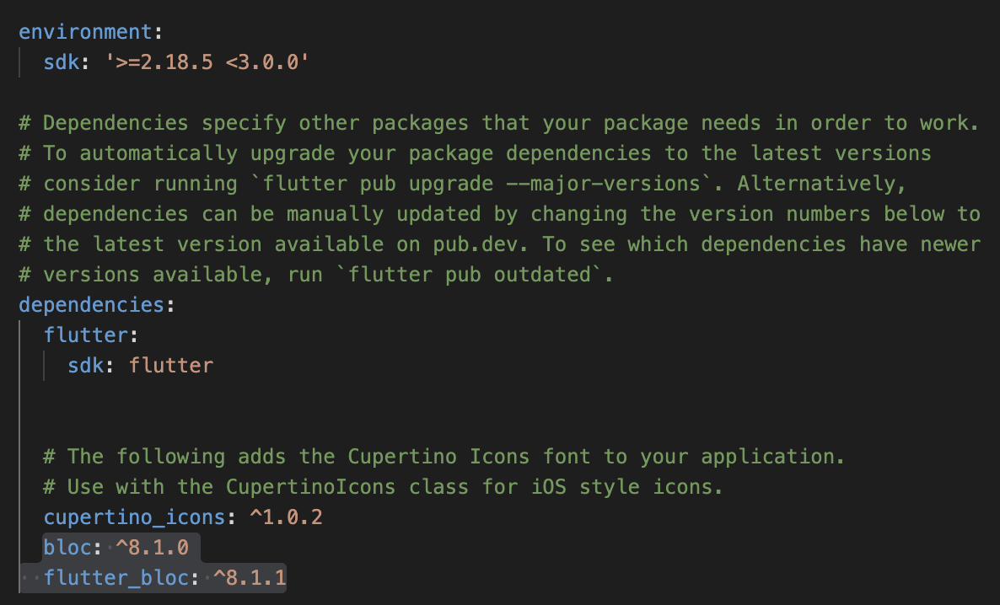

# ПРАКТИЧЕСКАЯ РАБОТА №4

## Cubit.

--------------------------

Цель работы: создать проект с использованием Cubit. Реализовать счетчик при нажатии на кнопку + осуществляет увеличение счетчика, при нажатии на кнопку - осуществляться уменьшение счетчика. Если текущая тема устройства светлая, то за одно нажатие должно +1 или -1. Если текущая тема устройства темная, то за одно нажатие должно +2 или -2. Каждое действие должно записываться в историю. История должна быть реализована через виджет ListView

--------------------------

Ход работы:

Cubit стримит изменение состояний (State) в UI. Для передачи нового состояния нужно вызвать emit у Cubit. Обычно изменение состояния вызывается со слоя данных, через другой Stream.
Для начала работы с библиотекой ее нужно подключить в pubspec.yaml. 

Рисунок 1 - Подключение библиотек

Все действия пользователь производит при помощи интерфейса, который прописан в файле main_page.dart.
 
 

Рисунок 2 - Файл main_page.dart (1)

 
Рисунок 3 - Файл main_page.dart (2)

 
Рисунок 4 - Файл main_page.dart (3)

Далее необходимо создать Cubit файлы для счетчика, темы и списка. Везде Cubit работает по одному принципу. Переменная с интерфейса отправляется в файл Cubit, где переадресовывается в файл State, там записывается старое значение переменной, потом эта переменная переходит в Cubit, где она изменяется и после выводится на интерфейс.
Далее будет показана реализация Cubit файлов для счетчика, темы и списка.

 
Рисунок 5 - counter_state.dart

 
Рисунок 6 - counter_cubit.dart

 
Рисунок 7 - list_cubit.dart

 
Рисунок 8 - list_state.dart

 
Рисунок 9 - light_dark_state.dart

 
Рисунок 10 - light_dark_cubit.dart

А main.dart выглядит так:

 
Рисунок 11 - main.dart
 

Рисунок 12 - Результат работы

-----------

Вывод: в ходе выполнения данной практической работы удалось изучить и проверить на практике, путем создания проекта, в котором реализован счетчик, работу Cubit.
